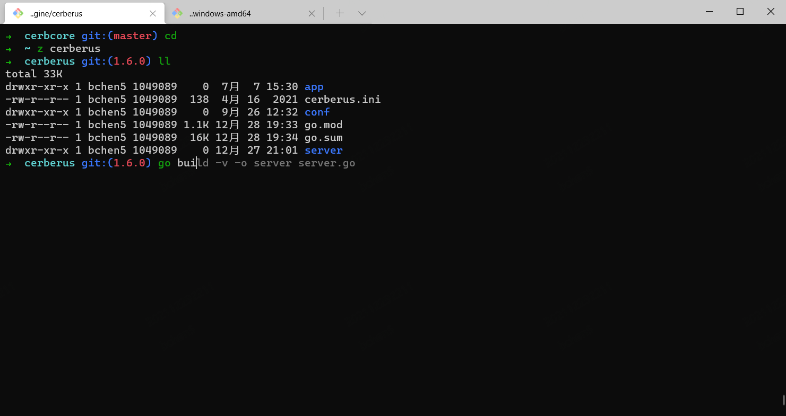
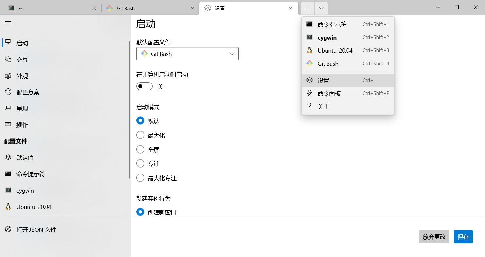
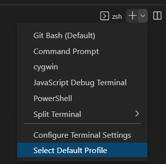
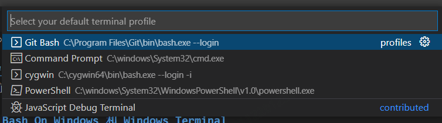
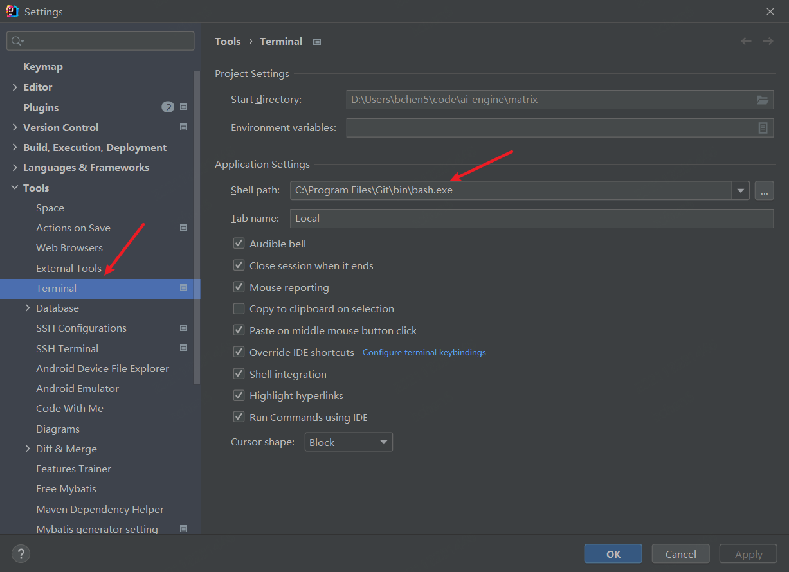
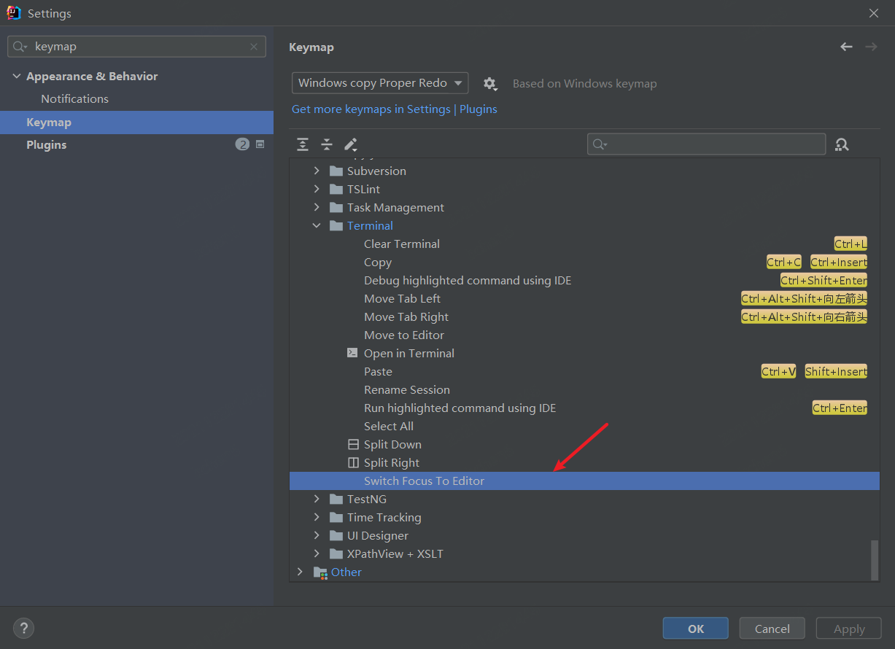

# windows 配置 Linux like terminal
> Termianl 颜值是第一生产力



## 1 安装 Git Bash On Windows 和 Windows Terminal
1. 在 windwos 上下载安装 [Git](https://git-scm.com/downloads)
2. 从 windows store 安装 windows terminal

新版本的 windows terminal 能够自动识别 git 路径了，并且支持可视化设置默认启动的 shell



这样简单的安装设置之后，已经比 windows 原来的 cmd 好看也好用多了，git bash 带来了更好的 git 目录状态显示，带来了类 linux 的命令行操作，windows terminal 带来了更好看的交互界面，复制粘贴也能直接 ctrl-c ctrl-v 了，一切都很美好

执行 `echo "alias ll='ls -l'" >> ~/.bashrc`, 方便后面执行 `ll` 显示目录树

## 2 在 vscode 和 idea 中启用 git bash
### 2.1 设置 vscode terminal
**ctrl-`** 调出 termianl，从下拉框选择 default profile，一般 vscode 也能自动识别到 git bash，否则需要手动添加 profile 了，可参考[官网设置](https://code.visualstudio.com/docs/editor/integrated-terminal#_configuring-profiles)




### 2.2 设置 idea terminal
在 idea 设置页面查找 terminal，并将执行的 shell 执行 gitbash



由于 idea 默认在 terminal 按 esc 会使 terminal 失焦，导致在 terminal 使用 vim 时无法退出编辑，所以需要取消这个快捷键，如图，删除 `Switch Focus To Editor` 的快捷键



## 3 使用 oh my zsh
oh my zsh 能让 shell 变得更加好看与智能。通过添加各种 plugin，能够为 shell 添加命令自动补全，命令高亮提示，目录快速跳转等功能
### 3.1 安装 zsh
安装 oh my zsh 前需要将 zsh 安装到 git bash 的环境中，由于 git bash 没有包管理器，所以需要手动下载。本仓库内置了一份 zsh5.8 的 tar 包，可以手动下载后将文件加压到 Git 的跟目录下。也可以在仓库的根目录下用 git bash 执行如下命令
```bash
cp -r tools/zsh/ /
```
为了启用 zsh，在 .bashrc 中添加
```shell
# Launch Zsh
if [ -e /usr/bin/zsh ]; then
    exec zsh
fi
```
这样，重新打开 terminal，就是 zsh 的环境了

### 3.2 安装 oh my zsh
```bash
sh -c "$(curl -fsSL https://raw.github.com/ohmyzsh/ohmyzsh/master/tools/install.sh)"
```
#### 3.2.1 zsh-autosuggestions
[安装指南](https://github.com/zsh-users/zsh-autosuggestions/blob/master/INSTALL.md#oh-my-zsh)
```bash
1. clone to zsh plugins
git clone https://github.com/zsh-users/zsh-autosuggestions ${ZSH_CUSTOM:-~/.oh-my-zsh/custom}/plugins/zsh-autosuggestions
2. add to .zshrc
plugins=( 
    # other plugins...
    zsh-autosuggestions
)
```
注：我拉取了 master 的 zsh-autosuggestions 发现使用的时候，会自动添加很多空格，导致这个插件功能没法使用，但是切换到 v0.6.4 这个 tag 之后就好了。github 上这个 [issue](https://github.com/zsh-users/zsh-autosuggestions/issues/615) 跟我碰到的问题是一样的
#### 3.2.2 zsh-syntax-highlighting
[安装指南](https://github.com/zsh-users/zsh-syntax-highlighting/blob/master/INSTALL.md#oh-my-zsh)
```bash
1. clone to zsh plugins
git clone https://github.com/zsh-users/zsh-syntax-highlighting.git ${ZSH_CUSTOM:-~/.oh-my-zsh/custom}/plugins/zsh-syntax-highlighting
2. add to .zshrc
plugins=( 
    # other plugins...
    zsh-syntax-highlighting
)
```
#### 3.2.3 目录跳转 z.sh
[使用说明](https://github.com/rupa/z)
zsh 默认安装了 z.sh，所以直接在 plugin 里添加
```
plugins=( 
    # other plugins...
    z
)
```

## 4 安装其他命令
添加 tree 和 wget 命令
```bash
cp tools/*.exe /usr/bin
```


## refrence:
1. https://gist.github.com/fworks/af4c896c9de47d827d4caa6fd7154b6b
2. https://github.com/xnng/my-git-bash
3. http://gnuwin32.sourceforge.net/
4. https://dev.to/flyingduck92/add-tree-to-git-bash-on-windows-10-1eb1
